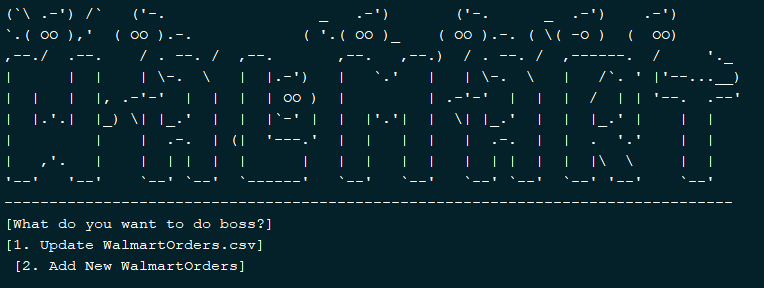

# Wal-Ord
###### Simplify and keep track of your Walmart Orders

-----
> - Just for fun project to learn more about Go-Rod and Go-Libraries.
> - Some aesthetic ASCII to hide that it has no GUI. :upside_down_face:
> - May have bugs.
> - Few things to add to really ***polish*** it off.

-----------

####Functionality
> - Program asks a user to input the E-mail used with the order and then their OrderID.
> - Automatically uses those inputs to submit on Walmart's Track Order Page.
> - If this is the first time, it will create a "WalmartOrders.csv".
> - If this is not the first time, it will append to "WalmartOrders.csv"
> - Walmart is always changing their delivery status. So I added the ability to allow users to 
    automatically update their "WalmartOrders.csv" easily.
> - This will output a new file "WalmartOrders2.csv".
 

######TO-DO://
> - Support discord webhooks.
> - Support txt file, so user's can input a txt file in format emails:orderIDs
> - Some more things to add...
> - ***FIND AND FIX BUGS***